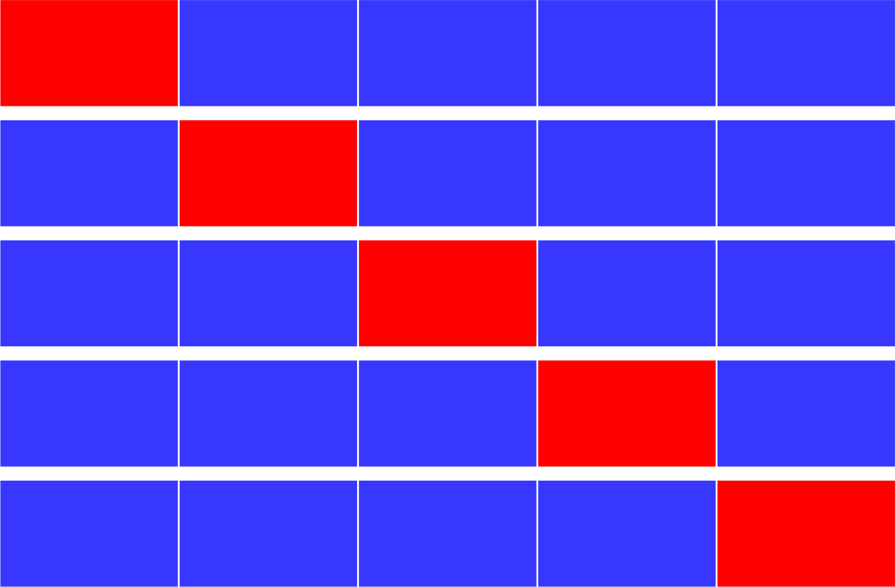

# Concepts in Machine Learning exam (AU, winter 2022)

## What is cross-validation?

Split data in \\(n\\) parts. Do \\(n\\) rounds \\(i = 1..n\\), where you train on all but the \\(i\\)'th element. Validate data on that on data point.

**In practice:** split in 5 parts:

## What are N-grams?

An N-gram is a sequence of N words. For example, a 2-gram could be "ate soup" "Seven Eleven" or "small bucket".

## What is CBOW?

CBOW stands for Continuous Bag of Words.

CBOW is a way to predict the middle word from the context of the surrounding words taking synonyms into account.

## What is a Skip-gram?

A skip-gram is a way to predict words surrounding the key word, basically predicting context from words.

## What is bagging?

Bagging stands for **B**ootstrap **agg**regation. It is done over several steps:

- Create a single bootstrapped dataset. This is done by creating a dataset of the same size as the original, using random sampling with replacement.
- Create a classifier from this dataset, usually a random tree.
- Test the classifier using _out-of-bag error_ testing using the data that was not sampled for a given tree. Repeat first two steps a large amount of times.
- Return a single voting classifier constructed from the classifiers made in the previous step: \\(f(x) = sign(\sum_{t = 1}^T h_t(x))\\)

## What is random forest?

A random forest is a voting classifier constructed using Bagging to create random trees.

Each tree is built on a subset of features, but not all.

All trees have equal say.

## Describe the boosting algorithm:

- Run algorithm \\(T\\) times (not on the same data set!), producing hypotheses \\(h_1,...,h_T\\)
- Compute the weights \\(\alpha_1, ..., \alpha_T\\)
- Return voting classifer: \\(f(x) = \text{sign}(\sum_{t=1}^T \alpha_t h_t(x))\\)

## If we perform convolution with a \\(k \times k\\) how would the image be padded?

If \\(k\\) is odd, we would pad the image, by extending the frame by \\((k-1)/2\\) \\(0\\)'s i.e for \\(k = 5\\):

[latex]
\begin{matrix}
0.2 & 0.2 & 0.2 & 0.2 & 0.2 & 0.6 \\
0.2 & 0.2 & 0.2 & 0.2 & 0.2 & 0.6 \\
0.2 & 0.2 & 0.2 & 0.2 & 0.2 & 0.6 \\
0.2 & 0.2 & 0.2 & 0.2 & 0.2 & 0.6 \\
0.2 & 0.2 & 0.2 & 0.2 & 0.2 & 0.6 \\
0.2 & 0.2 & 0.2 & 0.2 & 0.2 & 0.6
\end{matrix} \rightarrow
\begin{matrix}
0 & 0 & 0   & 0   & 0   & 0   & 0   & 0   & 0 & 0 \\
0 & 0 & 0   & 0   & 0   & 0   & 0   & 0   & 0 & 0 \\
0 & 0 & 0.2 & 0.2 & 0.2 & 0.2 & 0.2 & 0.6 & 0 & 0 \\
0 & 0 & 0.2 & 0.2 & 0.2 & 0.2 & 0.2 & 0.6 & 0 & 0 \\
0 & 0 & 0.2 & 0.2 & 0.2 & 0.2 & 0.2 & 0.6 & 0 & 0 \\
0 & 0 & 0.2 & 0.2 & 0.2 & 0.2 & 0.2 & 0.6 & 0 & 0 \\
0 & 0 & 0.2 & 0.2 & 0.2 & 0.2 & 0.2 & 0.6 & 0 & 0 \\
0 & 0 & 0.2 & 0.2 & 0.2 & 0.2 & 0.2 & 0.6 & 0 & 0 \\
0 & 0 & 0   & 0   & 0   & 0   & 0   & 0   & 0 & 0 \\
0 & 0 & 0   & 0   & 0   & 0   & 0   & 0   & 0 & 0 \\
\end{matrix}
[/latex]

## What is VC-dimension?

VC-Dimension, \\(d\\), for hypothesis set, \\(H\\), is the largest integer, such that there exists a dataset of size \\(d\\) which can be shattered by \\(H\\).

In other words:
\\[d_H = breakpoint_H - 1\\]

## What is a break point?

If no dataset of \\(k\\) samples can be shattered by hypothesis, \\(H\\), \\(k\\) is a break point for \\(H\\). Also:

\\(breakpoint = VC + 1\\)

## What is shattering?

A set of \\(k\\) samples is shattered by hypothesis set, \\(H\\), if all \\(2k\\) dichotomies can be generated by \\(H\\).

